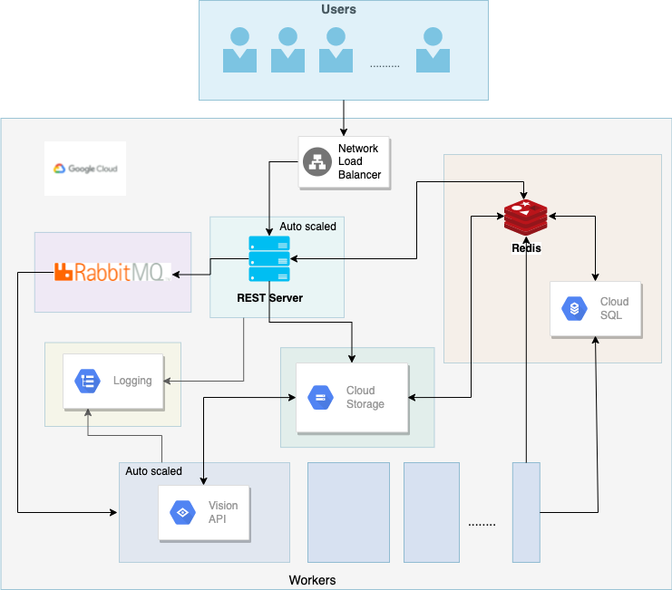

<div align="center">
  <p>
    
  </p>

  <h1 align="center">Scalable contextual image indexing and search</h1>

  <p align="center">
    CSCI 5253 - Data Center Scale Computing - Final Project
    <br />
   
</div>


<!-- TABLE OF CONTENTS -->
<details>
  <summary>Table of Contents</summary>
  <ol>
    <li>
      <a href="#about-the-project">About The Project</a>
      <ul>
        <li><a href="#components">Components</a></li>
        <li><a href="#architecture">Architecture</a></li>
      </ul>
    </li>
    <li>
      <a href="#getting-started">Getting Started</a>
      <ul>
        <li><a href="#prerequisites">Prerequisites</a></li>
        <li><a href="#installation">Installation</a></li>
      </ul>
    </li>
    <li><a href="#workflow-of-the-system">Workflow of the system</a></li>
    <li><a href="#authors">Authors</a></li>
    <li><a href="#acknowledgments">Acknowledgments</a></li>
  </ol>
</details>


<br>

<!-- ABOUT THE PROJECT -->
## About The Project

There are about 2.5 quintillion bytes of data produced by humans every day and much of it includes images. With this massive amount of data, it can be substantially hard to find one particular image even if organized well. So thinking on those terms, we have built a service that enables users to store and retrieve images based on contextual keywords. The functionality of the application would be to provide a service where users will be able to upload images, followed by the system identifying and extracting contextual keywords from the same. Later the service can be used by the user to search for any image in the collection based on contextual keywords and similar images are returned along with a safe search tag added to it. 

The project goal can be broadly classified to have the following major components:

- Scalable context feature extraction - The app is devised to take in images as input, store them and extract the contextual keywords all while being able to auto-scale based on load.

- Safe search tagging - Based on details extracted from the image using the Google cloud vision API, the content is tagged for violence, racy, spoofed, and adult content. 

- Scalable search - The system is also built to search for the images based on contextual keywords and auto-scale when the load increases.

<br>

<a  style="font-size: 20px;" href="youtu.be/5kxw3lritfk">Project Video link </a>
<p align="right">(<a href="#top">back to top</a>)</p>


<!-- Components -->
## Components
<br>

* Kubernetes
* RabbitMQ
* Redis
* CloudSQL
* Flask REST server
* Google Cloud storage(Bucket)
* Google Cloud Vision API 

<p align="right">(<a href="#top">back to top</a>)</p>


<!-- Architecture -->
## Architecture 

<br>

 <p align="center">
    
  </p>

<br>
<p align="right">(<a href="#top">back to top</a>)</p>

<!-- GETTING STARTED -->
## Getting Started

The project follows a microservice architecture so the application can be broadly divided into 5 components:
<br>
- Rest-server
- Worker
- Redis 
- RabbitMQ
- Log server

<br>

### Prerequisites

The following software, accounts and tools are required to get the project up and running:

* Google cloud account with active credits 
* gcloud command-line tool
* Docker
* Kubernetes enable on Docker or Google Kubernetes engine
* Python 
* Redis-CLI
* Python libraries found in the requirements file of rest-server and worker


<p align="right">(<a href="#top">back to top</a>)</p>

### Installation

_Below is an example of how you can instruct your audience on installing and setting up your app. This template doesn't rely on any external dependencies or services._

1. Get a free API Key at [https://example.com](https://example.com)
2. Clone the repo
   ```sh
   git clone https://github.com/your_username_/Project-Name.git
   ```
3. Install NPM packages
   ```sh
   npm install
   ```
4. Enter your API in `config.js`
   ```js
   const API_KEY = 'ENTER YOUR API';
   ```

<p align="right">(<a href="#top">back to top</a>)</p>


<!-- Workflow of the system -->
## Workflow of the system
<br> 

- The orchestration starts with the user accessing the webpage from the base URL endpoint, which is served from the Flask server as the request is routed through the network load balancer. 

- Users can then upload an image in the web application and the contents are passed to the server using a POST endpoint. 

- The MD5 value of the image is generated and used as the ID to store the image in Google cloud storage.

- This is followed by the curation of the input data, which is sent to the worker node via RabbitMQ. 

- Worker nodes then dequeue the message from RabbitMQ, parse the data and retrieve the image from the Cloud Storage bucket using the MD5 value and then run it against the Google Cloud Vision API. 

- All the relevant contextual details and safe search tag extracted from the image is manipulated in the right format and stored in Redis and MySQL. 

- As these processes run, all the relevant debug and event information logs are written into a log server using RabbitMQ. 

- The end-user can search for the stored images using contextual keywords. The query is first run on Redis then MySQL to extract relevant images, if they are found, their public URLs along with safe search tags are rendered back else an appropriate message is displayed. 

- All the components run in their individual pods on the Google Kubernetes engine, thereby making them easy to deploy, and maintain. Horizontal scaling is enabled on the rest server and worker nodes which spin up new pods when the CPU utilization goes beyond a specified threshold. 


<p align="right">(<a href="#top">back to top</a>)</p>
 <br> 


<!-- Authors -->
## Authors

[Vishal Prabhachandar](https://www.linkedin.com/in/vishalprabha/)

[Srinivas Akhil Mallela](https://www.linkedin.com/in/srinivasakhilmallela/)
<p align="right">(<a href="#top">back to top</a>)</p>


<!-- ACKNOWLEDGMENTS -->
## Acknowledgments

Links to the resources used in the project. 

* [Google Cloud docs](https://cloud.google.com/docs)
* [Redis](https://hub.docker.com/_/redis)
* [rabbitMQ](https://hub.docker.com/_/rabbitmq)
* [Bulma](https://bulma.io/documentation/)
* [Flask Authentication](https://www.digitalocean.com/community/tutorials/how-to-add-authentication-to-your-app-with-flask-login)
* [Draw.io](https://www.draw.io/)

<p align="right">(<a href="#top">back to top</a>)</p>
